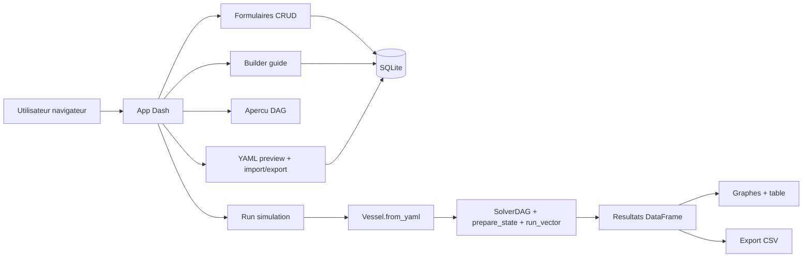
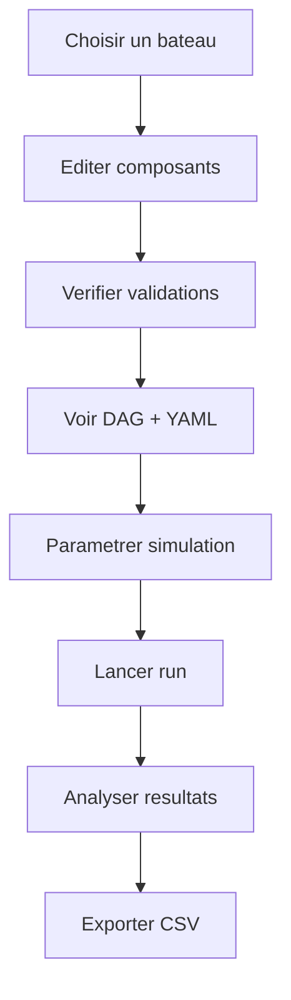

# Options 3 semaines + visuels potentiels (support client)

Ce document complete `dev/CLIENT_MVP_PROPOSITION.md` avec:
- des **options de livraison** comparables sur un horizon de 3 semaines;
- des **visuels de cadrage** (flux et wireframes) pour faciliter la discussion client.

## 1) Options de perimetre sur 3 semaines

## Option A - MVP strict (recommandee)
Objectif: livrer un socle robuste, exploitable en production simple.

Inclus:
- CRUD composants + bateaux/configurations;
- builder guide (liste/formulaire) avec validations;
- apercu DAG auto-mis a jour;
- synchro immediate composant -> graphe + YAML + erreurs;
- import/export YAML;
- execution solver (`mode: inverse`);
- visualisation des sorties principales + export CSV.

Non inclus:
- XLSX (sauf si marge en fin de sprint);
- historique avance des runs;
- UX avancee (multi-vues personnalisees).

Risque planning: faible a moyen.

## Option B - MVP+ orientee exploitation
Objectif: meme socle que A, avec plus de confort operationnel.

Ajouts par rapport a A:
- presets de simulation (sauvegarde/rechargement);
- historique minimal des runs (timestamp, config, statut);
- ecran "comparaison run N vs N-1" simple;
- export XLSX (si validation technique OK).

Risque planning: moyen.
Compromis: moins de temps pour polish visuel.

## Option C - MVP demo client (UX prioritaire)
Objectif: maximiser l'effet demo et la lisibilite metier.

Ajouts par rapport a A:
- ecran cockpit unifie (config + run + resultats dans un meme parcours);
- visualisations plus riches (2-3 graphes standards preconfigures);
- messages d'erreur et aide contextuelle plus pedagogiques.

Retrait possible pour tenir le delai:
- limiter l'historique des runs;
- repousser certains ecrans secondaires d'administration.

Risque planning: moyen a eleve (depend de l'effort UX).

## Recommandation de presentation client
- Proposer **Option A** comme engagement ferme.
- Presenter **Option B** et **Option C** comme variantes arbitrees en Go/No-Go fin semaine 1.

---

## 2) Decoupage par semaine (base Option A)

## Semaine 1 - Fondations + CRUD + YAML
- structure app Dash (pages + navigation + etat session);
- schema SQLite (single-writer), base de donnees initiale;
- CRUD composants et bateaux;
- import/export YAML;
- premier niveau de validations.

Livrable demo:
- creer/modifier/supprimer une configuration;
- exporter puis reimporter YAML.

## Semaine 2 - Builder + DAG + execution solver
- builder guide (liste composants + formulaire de liens);
- apercu DAG live;
- synchro immediate UI -> YAML -> validations;
- parametrage simulation;
- execution solver + gestion erreurs metier.

Livrable demo:
- scenario complet "configurer -> lancer simulation -> verifier etats".

## Semaine 3 - Resultats + export + stabilisation
- visualisation resultats (graphe + table);
- export CSV;
- stabilisation, tests utilisateurs, corrections ergonomie;
- documentation d'usage.

Livrable demo:
- scenario complet sans IDE, de la configuration a l'export CSV.

---

## 3) Visuel 1 - Architecture fonctionnelle (MVP)



---

## 4) Visuel 2 - Parcours utilisateur principal



---

## 5) Visuel 3 - Wireframe ecran "Builder + DAG"

```text
+----------------------------------------------------------------------------------+
| CGN Model Web - Builder energie                                                  |
+-------------------------------+-----------------------------+--------------------+
| Composants disponibles        | Configuration en cours      | Validations        |
|-------------------------------|-----------------------------|--------------------|
| [ + Ajouter ] [Filtre]        | Vessel: VEVEY_DEMO         | [OK] IDs uniques   |
| - motor (constant_eta)        | --------------------------  | [OK] Bus references|
| - genset (variable_eta)       | Inputs                      | [WARN] eta profile |
| - shaft_demand (input)        | - shaft_demand -> M:shaft   |                    |
| - navops (input)              | - navops -> E:main          |                    |
|                               | Converters                  |                    |
|                               | - fuel -> elec (genset)     |                    |
|                               | - elec -> shaft (motor)     |                    |
+-------------------------------+-----------------------------+--------------------+
| Apercu DAG (auto update)                                                        |
| [Input navops] --> [Electrical:main] --> [motor] --> [Mechanical:shaft]        |
| [Chemical:fuel] --> [genset] --> [Electrical:main]                              |
+----------------------------------------------------------------------------------+
| YAML live (lecture)                                                              |
| vessel: ...                                                                      |
| profiles: ...                                                                    |
| inputs: ...                                                                      |
+----------------------------------------------------------------------------------+
```

---

## 6) Visuel 4 - Wireframe ecran "Run + Resultats"

```text
+----------------------------------------------------------------------------------+
| CGN Model Web - Simulation                                                       |
+-------------------------------+-----------------------------+--------------------+
| Parametres simulation         | Statut execution            | Actions            |
|-------------------------------|-----------------------------|--------------------|
| dt [1.0] s                    | [OK] YAML valide            | [Lancer run]       |
| vitesse croisiere [7.0] m/s   | [OK] Solver pret            | [Arreter]          |
| course [Lavaux - Haut-Lac]    | [RUN DONE] 18.4 s           | [Exporter CSV]     |
+-------------------------------+-----------------------------+--------------------+
| Resultats (graphe)                                                               |
| [time_s vs motor_out_W]   [time_s vs fuel_tank_p_W]                              |
| (Plotly)                                                                          |
+----------------------------------------------------------------------------------+
| Resultats (table)                                                                 |
| time_s | speed_m_per_s | motor_out_W | genset_out_W | fuel_tank_e_cum_J          |
| 0.0    | ...           | ...         | ...          | ...                         |
+----------------------------------------------------------------------------------+
```

---

## 7) Liste d'engagement presentable au client

- Sans IDE: parcours complet via navigateur.
- Compatibilite solver existant: aucune reecriture du coeur physique.
- Contrat YAML conserve (import/export natif).
- Delai 2-3 semaines tenu avec pilotage Go/No-Go hebdomadaire.
- Option d'evolution claire: SQLite -> PostgreSQL si besoin multi-ecriture.

